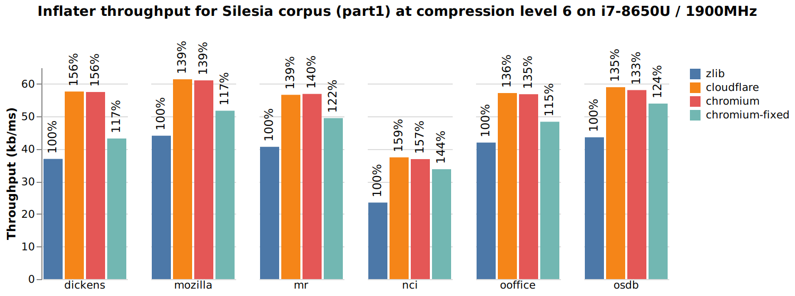
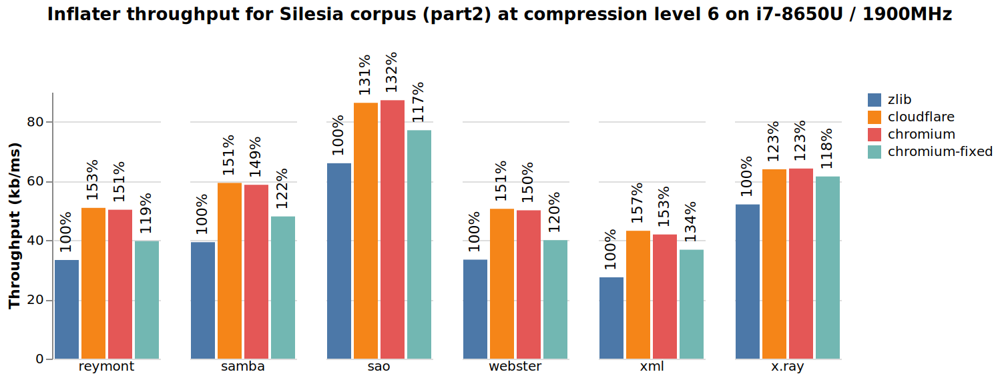
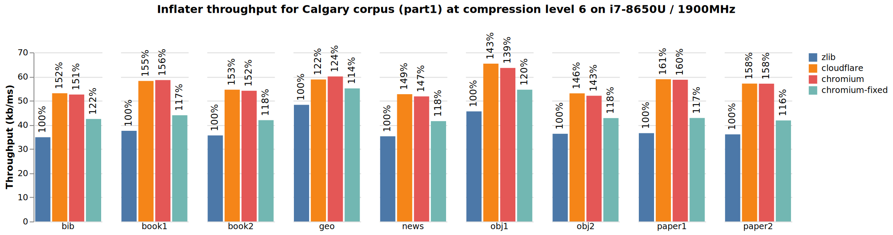
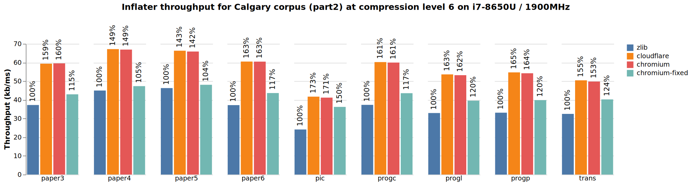

# zlib-chromium

This is a fork of https://chromium.googlesource.com/chromium/src/third_party/zlib which is itself a fork of [Mark Adler's](http://en.wikipedia.org/wiki/Mark_Adler) [zlib](http://zlib.net/) from https://github.com/madler/zlib

zlib-chromium is part of the larger [Chromium project](https://chromium.googlesource.com/chromium) which comes with it's own build system. I've added a simple build script under `build/build.sh`. If called, it will build `libz.so` under `build/` and symlink it to `build/libz.so.1`.

See [README.chromium](./README.chromium) for zlib-chromium specific information.

## Inflater improvements in zlib-chromium

[zlib-chromium](https://chromium.googlesource.com/chromium/src/third_party/zlib/) improves the inflation speed of the original [zlib](https://github.com/madler/zlib) library by more than 50% (see graphs at the end of this document). One reason for these improvements is the usage of 128bit vector load and store instructions. In order order to further optimize performance, zlib-chromium sometimes writes additional bytes beyond the last inflated byte. To explain this with an example, lets assume your source text looks as follows:
```
123456789abcdefg123456789
```
And zlib already inflated a deflated version of this text (how that looks like is not important here) up to the the letter `g` (`.` indicate yet unused space in the buffer which was handed over to zlib's `inflate(..)` method):
```
123456789abcdefg..................
```
The zlib compression algorithm recorded in the deflated stream that after `g` there's a repetition of the first 9 characters of the original text. So the original zlib implementation will copy these 9 characters to inflate stream:
```
123456789abcdefg123456789.........
```
However, the optimized `inflate(..)` method from the zlib-chromium implementation will use a 128bit (i.e. 16byte) load a and store instructions to achieve this, resulting in the following output:
```
123456789abcdefg123456789abcdefg..
```
As you can see, the chromium version wrote 7 more characters but it is faster because it did this with a single instruction. There's two important points to notice here. First, zlib-chromium will never write beyond the space which is available in the output buffer. But because the output buffer is usually quite large compared to an optimized 16byte load/store operation, a lot of these operations can be done without an explicit check as long as the length of the currently inflated output is below the buffer length minus a security margin of say 2*16bytes. Second, both the original and the optimized chromium zlib version will report the correct number of inflated bytes (i.e. 24 in our example).

So zlib-chromium is using the extra head-room available in the output buffer for optimizing the inflation speed. That's perfectly fine as long as users of the library do not rely on the fact that the inflate call won't write more than the number of inflated bytes to the output buffer. Imagine a client of the library initializes the output buffer with zeros, inflates a text file into the buffer and expects that he will be able to access that text as a null-terminated string afterwards. That will work with the original zlib implementation but not necessarily with the optimized zlib-chromium implementation.

The original zlib behavior isn't specified as a normative requirement - it is merely an implementation detail. But it may still break clients which implicitly depend on this implementation detail. In order to make these difference more obvious, the zlib-chromium developers have decided to always and unconditionally write some padding bytes beyond the last inflated character as long as there's space in the output buffer (see [this change](https://chromium.googlesource.com/chromium/src/third_party/zlib/+/015fb32fd2082e802e4e911129628e201ae7def1%5E%21/#F3)).

In order to measure the effect of this optimization, I've created the branch [omit-writing-beyond-stream-end](https://github.com/simonis/zlib-chromium/tree/omit-writing-beyond-stream-end) where I only use the optimized 128bit loads and stores when we can be sure to not write beyond the last inflated character. However, as you can see from the benchmark results at the end of this document ("chromium-fixed" is the version built from the "omit-writing-beyond-stream-end" branch), the performance regressions are quite significant if we want to maintain the invariant of not touching the output buffer after the last inflated character. 

### zlib/inflater usage in OpenJDK

Java supports zlib compression/decompression since version 1.1. The [`java.util-zip.Inflater`](https://docs.oracle.com/en/java/javase/11/docs/api/java.base/java/util/zip/Inflater.html) class' [`inflate(byte[] output, int off, int len)`](https://docs.oracle.com/en/java/javase/11/docs/api/java.base/java/util/zip/Inflater.html#inflate(byte%5B%5D,int,int)) method maps directly to zlib's `inflate(..)` method. The method returns the number if inflated bytes and doesn't impose any restrictions on using its `byte[]` as scratch buffer by the native `inflate(..)` function.

Java also provides the [`InflaterInputStream`](https://docs.oracle.com/en/java/javase/11/docs/api/java.base/java/util/zip/InflaterInputStream.html) class which has a `read(..)` method with the same signature like `Inflater::read(..)`. `InflaterInputStream::read(..)` directly dispatches to the `read(..)` method of an embedded `Inflater` object. However, because `InflaterInputStream` derives from [`java.io.InputStream`](https://docs.oracle.com/en/java/javase/11/docs/api/java.base/java/io/InputStream.html) its `read(byte[] b, int off, int len)` method is a little more constrained. It specifically specifies that if *k* bytes have been read, then "these bytes will be stored in elements `b[off]` through `b[off+`*k*`-1]`, leaving elements `b[off+`*k*`]` through `b[off+len-1]` **unaffected**".

Until now I'm not aware of any Java application which relies on this strong guarantee (except for the OpenJDK [`test/jdk/jdk/nio/zipfs/ZipFSOutputStreamTest.java`](https://github.com/openjdk/jdk/blob/ff0cb98965a0b6be2f6c399e4645630c10b3466e/test/jdk/jdk/nio/zipfs/ZipFSOutputStreamTest.java) JTreg regression test). However, the fact that zlib-chromium unconditionally pads its output paired with an inefficient implementation of `InflaterInputStream`'s `read(..)` method already led to issues in the popular [Spring](https://github.com/spring-projects/spring-framework/issues/27429) and [ASM](https://gitlab.ow2.org/asm/asm/-/issues/317955) libraries. For more details, take a look at the issue [JDK-8281962: Avoid unnecessary native calls in InflaterInputStream](https://bugs.openjdk.java.net/browse/JDK-8281962) (and the corresponding [pull request](https://github.com/openjdk/jdk/pull/7492)) which partially fixed that issue for JDK 19 and [JDK-8283758: Weaken the InflaterInputStream specification in order to allow faster Zip implementations](https://bugs.openjdk.org/browse/JDK-8283758) which relaxed the specification in JDK 20 to allow padding bytes beyond the last inflated byte.

In short, the Spring/ASM issue mentioned before is caused by `InflaterInputStream`'s behavior to require an extra call to the native `inflate(..)` function just to realize that the stream has already been fully inflated. With Chromium's zlib implementation, this extra call will overwrite the beginning of the output buffer with padding bytes, although not a single byte of inflated data has been produced and make the following Java coding pattern fail:
```java
int readcount = 0;
while ((bytesRead = inflaterInputStream.read(data, 0, bufferSize)) != -1) {
    outputStream.write(data, 0, bytesRead);
    readCount++;
}
if (readCount == 1) {
    return data;         //  <---- first bytes might be overwritten
}
return outputStream.toByteArray();
```
This will result in the following [exception in ASM](https://gitlab.ow2.org/asm/asm/-/issues/317955):
```
java.lang.IllegalArgumentException: Unsupported class file major version 21845
  at org.springframework.asm.ClassReader.<init>(ClassReader.java:199)
  at org.springframework.asm.ClassReader.<init>(ClassReader.java:180)
  at org.springframework.asm.ClassReader.<init>(ClassReader.java:166)
  at org.springframework.asm.ClassReader.<init>(ClassReader.java:287)
  ...
```

In order to support zlib-chromium in older version of Java, this special case could also be handled in zlib-chromium itself, by avoiding the padding bytes in cases where no output is produced at all. I've therefore opened [issue 1302606](https://bugs.chromium.org/p/chromium/issues/detail?id=1302606) in the Chromium project and proposed the fix from the [fix-padding-when-no-output](https://github.com/simonis/zlib-chromium/commit/424c27eb80718838d5ec38e00f91c9d584c98e30) branch in this repo.

### zlib-cloudflare

All the above applies to [zlib-cloudflare](https://github.com/cloudflare/zlib) as well because it has integrated most of the inflate optimizations from zlib-chromium. This was meanwhile fixed with [PR 31](https://github.com/cloudflare/zlib/pull/31") which basically imported the corresponding fix from zlib-chromium.

## Benchmark details

The following results were measured on a Laptop with an Intel i7-8650U CPU running Ubuntu 18.04. On the laptop, hyper-threading and turbo-boost were switched off, the CPU frequency was set to a fixed value of 1900MHz and the benchmark was run in its own [cpuset](http://manpages.ubuntu.com/manpages/bionic/man1/cset-set.1.html) as root user (see [`benchmarks/bash/benchmark_start.sh`](https://github.com/simonis/zlib-bench/blob/master/benchmarks/bash/benchmark_start.sh)). 

For the benchmarks I've used the program [`zbench.c`](https://github.com/simonis/zlib-bench/blob/master/benchmarks/c/zbench.c) and `LD_PRELOAD`ed the various different implementations as can be seen in the harness script [`run-native-deflate.sh`](https://github.com/simonis/zlib-bench/blob/master/benchmarks/bash/run-native-deflate.sh).

The following graphs show the inflation throughput of the various zlib versions. "zlib" is Mark Adlers original zlib version from https://github.com/madler/zlib/tree/cacf7f1d, "cloudflare" is Cloudflares zlib version from https://github.com/cloudflare/zlib/tree/959b4ea3, "chromium" is Chromiums's zlib version from https://chromium.googlesource.com/chromium/src/third_party/zlib/+/3fc79233/ and "chromium-fixed" is the same like "chromium" but without any writes beyond the last inflated character (i.e. https://github.com/simonis/zlib-chromium/tree/omit-writing-beyond-stream-end). As input data for all implementations I took the original files from the [Silesia](http://www.data-compression.info/Corpora/SilesiaCorpus/index.html) and [Calgary](http://www.data-compression.info/Corpora/CalgaryCorpus/) corpus and compressed them with the original "`zlib`" version at the default compression level 6.

|  |
|-------|
|  |
|-------|
|  |
|-------|
|  |

